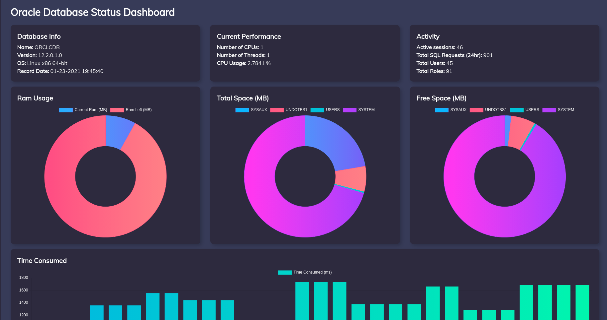
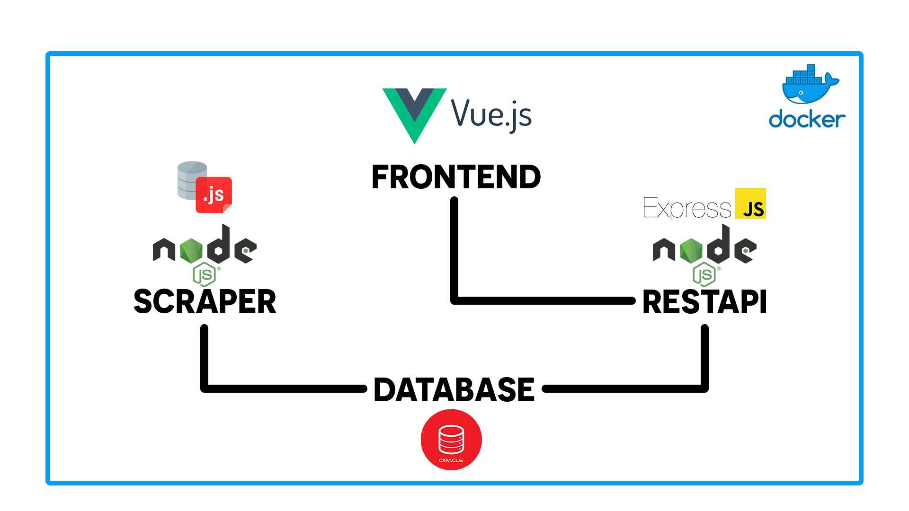

# Oracle Database Monitor

We made a REST API using ExpressJS, which delivers Oracle Database time-based resources informations to our Web App (made in VueJS), thus permitting the display of analysis and control over that information on that platform (Database Administration and Operation assignment @ UMinho)

## Set-up

```bash
docker-compose up -d --build --remove-orphans

cd webapp

npm run dev
```

## Interface


## Arquitecture

