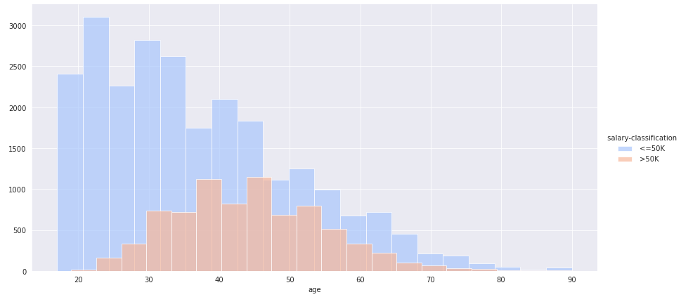

* Read this in other languages: [English](README.md), [Portuguese](README.pt.md)

# Learning and Knowledge Extraction
# Learning objectives

- Identify, describe and define the main concepts related to data systems,
analytical processing, mining, knowledge extraction and machine learning.
- Use, classify and evaluate existing or developing applications.
- Select the appropriate methodologies and apply software available to solve real problems, while
level of data analysis, data mining, knowledge extraction and decision making.
- Know and be able to implement the main algorithms related to mining techniques
data, knowledge extraction and forms of learning.

# Syllabus

* Learning Systems
  - Artificial Neural Networks
  - Genetic Computing
  - Group Intelligence
  - Case-based reasoning
* Knowledge extraction from data
  - General Concepts
  - Goals
  - Methodologies
  - Techniques
  - Tools

  <h1>Use cases</h1>
  
  

  
  

  
  

  
  

  

